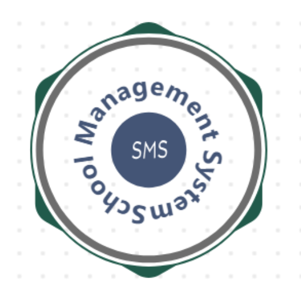

<p align="center"><a href="https://github.com/rayusamBoy/Laravel_tenancy_sms" target="_blank"></a></p>

## About

This is a multi-tenant school management system powered by technologies including the [Laravel framework](https://laravel.com), [Bootstrap](https://getbootstrap.com), [jQuery](https://jquery.com), and the [Tenancy package](https://tenancyforlaravel.com), among others. It is developed for educational institutions such as schools and colleges and is built on Laravel 11.

**Please refer to the [NOTICE](https://github.com/rayusamBoy/Laravel_tenancy_sms/blob/main/NOTICE.md) file for any changes you may be required to apply.**

## Features & Screenshots

### Features

* Tenancy capability
* Progressive Web App (PWA) features including Offline access
* Color modes (dark and light)
* Built-in messaging and notifications
* Eight (8) types of user accounts
  * `Super admin`
    * Create any user account
    * Can delete any record
    * Only can access System Settings, Bin and Activity Log
    * Manage all notices
    * Can perform all `Admin` function
    * Only can create & delete message thread
  * `Admin`
    * Create, edit and manage user accounts
    * Create, edit and manage Subjects, Exams, Assessments, Books, Pins, Query builder etc.
    * Manage payments
    * Manage own notices
  * `Teacher`
    * Manage own Class/Section
    * Manage Exam records for own Subjects
    * Manage timetable if assigned as Class Teacher
    * Manage own profile
  * `Student`
    * Manage own profile
    * View own subjects and results sheets
    * View own assessments sheets
    * View library and book status
    * View notices and school events in calendar
  * `Parent`
    * Manage own profile
    * View, print/download own child's marksheet, assessmentsheet
    * View own child's timetable
    * View own child's payments
    * View notices and school events in calendar
  * `Accountant`
    * Manage payments & fees
    * Print Payments receipts
    * Manage own profile
    * Manage own notices on notice board
  * `Librarian`
    * Manage library books and book requests.
    * Manage own profile
  * `Companion`
    * Manage own profile
    * View students
* Among others.

#### Screenshots

`Non tenancy` [browse files](/public/images/screenshots/non_tenancy/).

`Tenancy` [browse files](/public/images/screenshots/tenancy/).

> [!NOTE]
> Some of the screenshots may be outdated.

## Requirements

* [composer](https://getcomposer.org/)
* [npm](https://www.npmjs.com/)
* [laravel requirements](https://laravel.com/docs/11.x/deployment#server-requirements)
* Among others.

## Installation

1. Clone this repository, or you can download the **zip** folder instead.

   ```bash
   git clone https://github.com/rayusamBoy/Laravel_tanancy_sms.git
   ```

2. Change to the app installation directory.

   ```bash
   cd Laravel_tenancy_sms
   ```

3. Install the Composer dependencies.

   ```bash
   composer install
   ```

4. Install and build the Node packages.

   ```bash
   npm install
   npm run build
   ```

5. Create a `.env` file by copying the `.env.example` file.

   ```bash
   cp .env.example .env
   ```

6. Generate the `APP_KEY` by running the following command:

   ```bash
   php artisan key:generate
   ```

7. Generate the storage symlink.

   ```bash
   php artisan storage:link
   ```

8. Set values for specific keys in the `.env` file you created earlier.

   * `DB_DATABASE` - Database name (make sure you have created one). *Default connection:* `mysql`.
   * `DB_USERNAME` - Database username.
   * `DB_PASSWORD` - Database password.
   * `BROADCAST_CONNECTION` - *Default:* `reverb`. You can also opt for `pusher`. For `pusher`, make sure to set the appropriate values for any keys that start with `PUSHER_`, then you will need to activate the credentials [in this file](resources/js/bootstrap.js).
   * `APP_URL` - Your full qulified domain with protocol `https://` included. *Default:* `http://localhost`
   * `VITE_VAPID_KEY` - **(optional)**. Firebase Cloud Messaging (FCM) push services access token. To get a key and more [check this out](https://firebase.google.com/docs/cloud-messaging).
9. Migrate the database.

   ```bash
   php artisan migrate
   ```

10. Seed the database.

    ```bash
    php artisan db:seed --class=DatabaseSeederNonTenancy
    ```

11. **(optional)**. If you have set the optional value for `VITE_VAPID_KEY`, you must also configure the Firebase [in this file](public/assets/js/firebase-config.js) and provide the Firebase service account credentials [in this file](storage/app/firebase/service-account-credentials.json). The app will work perfectly fine even if you do not set these values.
12. **(optional)**. If you have set either or both of the options above, you must rebuild the node packages by running:

    ```bash
    npm run build
    ```

13. Start the `reverb` by running:

    ```bash
    php artisan reverb:start
    ```

14. **(locally)**. Open a new terminal, then serve the `app` and access it via the link `http://localhost:8000` by running:

    ```bash
    php artisan serve
    ```

15. **(production - live)**. Try searching Google for information on how to deploy a Laravel app based on your hosting plan.

> [!IMPORTANT]
> Whenever you set or update any value in the `.env` file for keys that start with `VITE_` and/or change the `BROADCAST_CONNECTION`, you must rebuild the node packages by running:
>
> ```bash
> npm run build
> ```

## Usage

1. Central app scope
   Once you have completed the installation, you can access the central app via the already running URL `http://localhost:8000` using the following credentials.


   | Account Type | Username | Email         | Password |
   | ------------ | -------- | ------------- | -------- |
   | IT Guy       | itguy    | itguy@sms.com | itguy    |

> [!IMPORTANT]
> When using a central domain other than `localhost` (e.g., `sms.edu`), you must add the domain to the `central_domains` key in the `tenancy`[configuration file](config/tenancy.php).

2. Tenant app scope
   To access the tenant app, you need to create a tenant and tenant domain in the central app. Once that's done, you can use the created domain to access the system with the following credentials.


   | Account Type | Username   | Email              | Password   |
   | ------------ | ---------- | ------------------ | ---------- |
   | Super Admin  | superadmin | superadmin@sms.com | superadmin |
   | Admin        | admin      | admin@sms.com      | admin      |
   | Teacher      | teacher    | teacher@sms.com    | teacher    |
   | Companion    | companion  | companion@sms.com  | companion  |
   | Parent       | parent     | parent@sms.com     | parent     |
   | Accountant   | accountant | accountant@sms.com | accountant |
   | Librarian    | librarian  | librarian@sms.com  | librarian  |
   | Student      | student    | student@sms.com    | student    |

> [!NOTE]
> For more information please refer to this [documentation](https://tenancyforlaravel.com).

## Contributing

See [contributing](https://github.com/rayusamBoy/Laravel_tenancy_sms/blob/main/CONTRIBUTING.md).

## Appreciation

This project is based on the [lav_sms](https://github.com/4jean/lav_sms) project by [4jean](https://github.com/4jean). This is my personal modification and adaptation of the original project. I would like to express my appreciation to him and to everyone who contributes.

## License

The School Management System is open-sourced software licensed under the [GPL-3.0 license](https://github.com/rayusamBoy/Laravel_tenancy_sms/blob/main/LICENSE).
